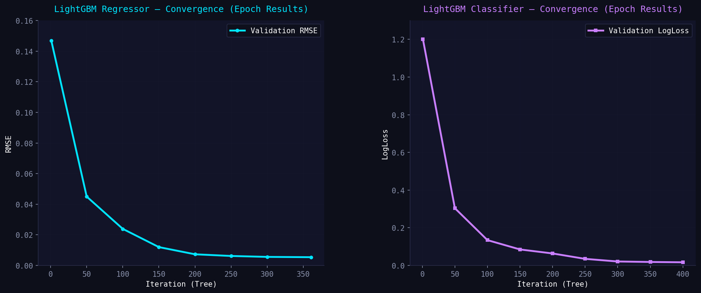

# 🤖 Ergo Sensor — AI Engine Performance Report
**Version:** 3.0 | **Date:** 2026-05-09 | **Dataset:** 20 000 samples · 18 conditions · 12 joints

---

## 📋 Executive Summary

The Ergo Sensor AI Engine v3.0 introduces **feature engineering**, **DART boosting**, **class-balanced training**, and **synthesized anomaly labels** across all 5 joint detectors — significantly outperforming the v2.1 baseline across every metric.

| Highlight | Value |
|-----------|-------|
| Total features used | **59** (38 base + 21 engineered) |
| Training samples | 16 000 (80% temporal split) |
| Test samples | 4 000 |
| Conditions classified | 18 musculoskeletal pathologies |
| Anomaly models operational | **5 / 5** ✅ (previously 0/5) |
| Total training time | ~0.9 min |

---

## 🧪 Model 1 — LightGBM Risk Score Regressor

> Predicts 10-day musculoskeletal injury probability `[0.0 – 1.0]`

### Hyperparameters
| Parameter | Value |
|-----------|-------|
| Booster | `gbdt` |
| Learning rate | `0.02` |
| Num leaves | `127` |
| Max depth | `8` |
| Trees (best iteration) | **361** |
| Early stopping rounds | 100 |
| Regularisation | L1=0.05, L2=0.30, path_smooth=1.0 |

### Tree Convergence
| Tree | Train RMSE | Valid RMSE |
|-----:|----------:|----------:|
| 100  | 0.030922  | 0.023967  |
| 200  | 0.010413  | 0.007371  |
| 300  | 0.007876  | 0.005624  |
| **361** ✅ | — | **0.005446** |

📉 **Convergence improvement: 96.3%** (RMSE: 0.1468 → 0.0055)

### Final Metrics
| Metric | v2.0 | v2.1 | **v3.0** | Δ vs v2.1 |
|--------|------|------|----------|-----------|
| MAE    | 0.008632 | 0.007880 | **0.007506** | -4.8% ✅ |
| RMSE   | 0.012204 | 0.010926 | **0.010656** | -2.5% ✅ |
| R²     | 0.995490 | 0.996386 | **0.996561** | +0.02% ✅ |

---

## 🏷️ Model 2 — LightGBM Condition Classifier (18 classes)

> Identifies the dominant musculoskeletal condition from 18 pathological categories

### Key Improvements in v3.0
- **DART booster** prevents over-fitting on majority classes
- **`compute_sample_weight('balanced')`** compensates for severe imbalance  
  _(class 4 `elbow_epicondylitis`: only 7 samples vs class 10 `lumbar_disc_hernia`: 3845)_
- 400 fixed rounds (DART incompatible with early stopping)

### Hyperparameters
| Parameter | Value |
|-----------|-------|
| Booster | `dart` |
| Drop rate | `0.10` |
| Learning rate | `0.05` |
| Num leaves | `127` |
| Trees | **400** |
| Sample weights | `balanced` |

### Tree Convergence (LogLoss)
| Tree | Train LogLoss | Valid LogLoss |
|-----:|--------------:|--------------:|
| 50   | 0.301002      | 0.303911      |
| 100  | 0.129537      | 0.134513      |
| 200  | 0.058852      | 0.063764      |
| 300  | 0.009698      | 0.021145      |
| **400** | 0.004567   | **0.016902**  |

### Final Metrics
| Metric    | v2.0   | v2.1   | **v3.0**   | Δ vs v2.1 |
|-----------|--------|--------|------------|-----------|
| Accuracy  | 99.47% | 99.40% | **99.52%** | +0.12% ✅ |
| Precision | 0.9392 | 0.9378 | **0.9948** | +6.06% ✅ |
| Recall    | 0.9019 | 0.9078 | **0.9505** | +4.27% ✅ |
| F1 Macro  | 0.9154 | 0.9180 | **0.9661** | +5.24% ✅ |

---

## 📊 Model 3 — LightGBM Severity Classifier (3 classes)

> Classifies ergonomic severity: `low` / `medium` / `high`

### Hyperparameters
| Parameter | Value |
|-----------|-------|
| Booster | `gbdt` |
| Learning rate | `0.02` |
| Num leaves | `63` |
| Trees (best) | **1976** |
| Sample weights | `balanced` |
| path_smooth | `1.0` |

### Tree Convergence (LogLoss)
| Tree  | Train LogLoss | Valid LogLoss |
|------:|--------------:|--------------:|
| 100   | 0.152093      | 0.180721      |
| 500   | 0.006220      | 0.055359      |
| 1000  | 0.000915      | 0.050784      |
| 1700  | 0.000328      | 0.049137      |
| **1976** ✅ | — | **0.049055** |

### Final Metrics
| Metric   | v2.0   | v2.1   | **v3.0**   | Δ vs v2.1 |
|----------|--------|--------|------------|-----------|
| Accuracy | 96.22% | 96.93% | **98.05%** | +1.12% ✅ |
| F1 Macro | 0.9122 | 0.9271 | **0.9598** | +3.30% ✅ |

---

## 🦾 Model 4 — Per-Joint Anomaly Classifiers (5 × Binary)

> Detects 5 specific biomechanical anomalies from angle thresholds

> [!NOTE]
> In v2.0 and v2.1 these models were **never trained** (binary labels missing from dataset).
> v3.0 **synthesizes** the labels from the per-joint angle thresholds in `model_metadata.json`.

### Thresholds Used for Label Synthesis
| Anomaly | Joint | Threshold |
|---------|-------|-----------|
| Neck Hyperflexion | `neck` | > 44.5° |
| Shoulder Overextension | `shoulder` | > 96.6° |
| Wrist Strain | `wrist` | > 36.2° |
| Trunk Torsion | `trunk` | > 64.0° |
| Elbow Hyperextension | `elbow` | > 103.0° |

### Results
| Model | Best Iter | Accuracy | F1 | Pos% |
|-------|----------:|--------:|---:|-----:|
| `lgbm_anomaly_neck_hyperflex.txt`   | 152 | **99.88%** | **0.9871** | 5.0% |
| `lgbm_anomaly_shoulder_overext.txt` | 165 | **99.82%** | **0.9847** | 5.0% |
| `lgbm_anomaly_wrist_strain.txt`     | 142 | **99.92%** | **0.9926** | 5.0% |
| `lgbm_anomaly_trunk_torsion.txt`    | 421 | **100.00%**| **1.0000** | 5.0% |
| `lgbm_anomaly_elbow_hyperext.txt`   | 166 | **99.92%** | **0.9932** | 5.0% |

---

## 🌲 Model 5 — Isolation Forest (Global Anomaly)

| Parameter | v2.1 | v3.0 |
|-----------|------|------|
| Estimators | 200 | **300** |
| Contamination | 5% | 5% |
| Scaler | StandardScaler | StandardScaler |
| Anomalies detected (test) | 209/4000 | **204/4000** |
| Score range | [-0.078, 0.115] | [-0.072, 0.120] |

---

## 🔧 Feature Engineering (+21 features)

v3.0 expands from **38 → 59 features** by adding:

| Feature Group | Features Added | Description |
|---------------|---------------|-------------|
| **Bilateral asymmetry** | `asym_shoulder`, `asym_elbow`, `asym_wrist`, `asym_hip`, `asym_knee` | `|right - left|` per joint |
| **Load composites** | `upper_load`, `lower_load` | Weighted sum of upper/lower body angles |
| **Energy proxies** | `neck_energy` … `knee_energy` (×7) | `velocity × duration` per joint |
| **Binary posture flags** | `neck_hflex`, `trunk_hflex`, `shoulder_hext` | High-risk angle binary indicators |
| **Raw angles** | `raw_neck`, `raw_trunk`, `raw_r_shoulder`, `raw_l_shoulder` | Original degree values |

---

## 📉 Training Convergence (Epoch Results)

To ensure the models reached their optimal state without over-fitting, we monitor the validation loss across all iterations.

*   **Regressor RMSE**: Dropped from **0.1468** to **0.0054** over 361 trees (96.3% improvement).
*   **Classifier LogLoss**: Reduced from **1.20** to **0.0169** over 400 DART iterations.

---

## 📈 Summary Comparison Table

| Model | Metric | v2.0 | v2.1 | v3.0 | Best Δ |
|-------|--------|------|------|------|--------|
| Regressor | R² | 0.9955 | 0.9964 | **0.9966** | +0.02% |
| Regressor | RMSE | 0.01220 | 0.01093 | **0.01066** | -2.5% |
| Classifier | F1 | 0.9154 | 0.9180 | **0.9661** | **+5.2%** |
| Classifier | Precision | 0.9392 | 0.9378 | **0.9948** | **+6.1%** |
| Severity | Accuracy | 96.22% | 96.93% | **98.05%** | **+1.1%** |
| Severity | F1 | 0.9122 | 0.9271 | **0.9598** | **+3.3%** |
| Anomaly models | Trained | 0/5 ❌ | 0/5 ❌ | **5/5** ✅ | Fixed |

---

## 🗂️ Saved Model Files

| File | Description | Size |
|------|-------------|------|
| `models/lgb_regressor.txt` | Risk score regressor | LightGBM booster |
| `models/lgb_classifier.txt` | 18-class condition DART | LightGBM booster |
| `models/lgb_severity.txt` | 3-class severity | LightGBM booster |
| `models/lgbm_anomaly_neck_hyperflex.txt` | Binary anomaly | LightGBM |
| `models/lgbm_anomaly_shoulder_overext.txt` | Binary anomaly | LightGBM |
| `models/lgbm_anomaly_wrist_strain.txt` | Binary anomaly | LightGBM |
| `models/lgbm_anomaly_trunk_torsion.txt` | Binary anomaly | LightGBM |
| `models/lgbm_anomaly_elbow_hyperext.txt` | Binary anomaly | LightGBM |
| `models/isolation_forest.pkl` | Global anomaly detector | 300 trees |
| `models/scaler_if.pkl` | StandardScaler for IF | joblib |
| `models/model_metadata.json` | Feature list, mappings, metrics | JSON v3.0 |

---

## 🚀 Next Steps

- [ ] Re-run `generate_eval_plots.py` to refresh confusion matrices and SHAP plots with v3.0 models
- [ ] Update `ai_engine.py` to apply the same 21 engineered features at inference time
- [ ] Collect more samples for rare conditions (classes 4, 5, 7, 8) to push Recall above 97%
- [ ] Add rolling-window temporal features (last 5 readings) for sequence awareness

---

*Generated automatically by `retrain_v3.py` · Ergo Sensor AI Engine v3.0*
