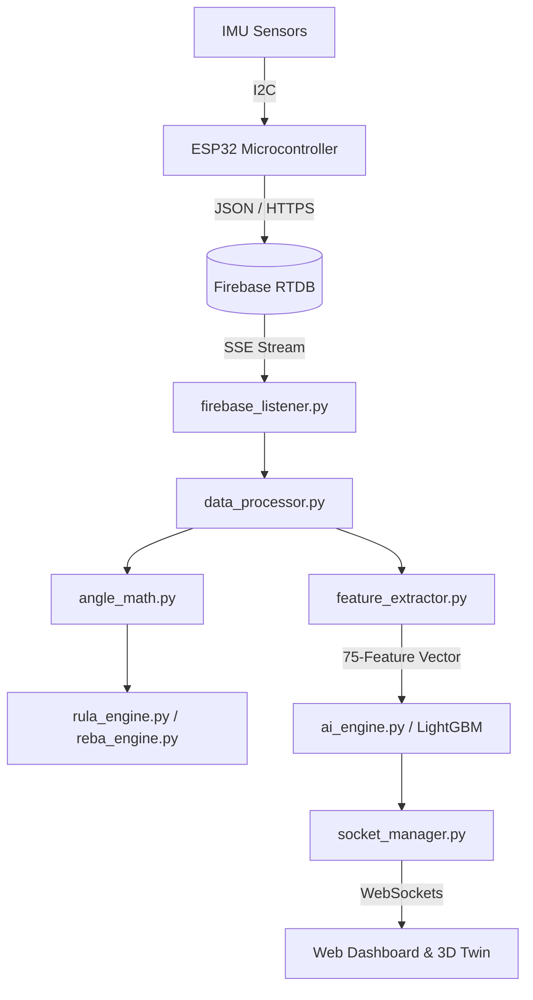

# 🎓 Ergo Sensor — Final Project Comprehensive Q&A (Defense Guide)

This document contains a structured list of questions and expert-level answers designed to prepare you for your final project defense. It covers the medical background, hardware, software, real-time pipeline, mathematics, and artificial intelligence aspects of the **Ergo Sensor** project.

---

## 📑 Table of Contents
1. [General & Project Overview](#1-general--project-overview)
2. [Clinical Background & Ergonomic Engines](#2-clinical-background--ergonomic-engines)
3. [Hardware Infrastructure & IoT Data Flow](#3-hardware-infrastructure--iot-data-flow)
4. [Signal Processing & Geometric Mathematics](#4-signal-processing--geometric-mathematics)
5. [Backend Architecture & Concurrency](#5-backend-architecture--concurrency)
6. [AI Engine v3.0-Production & Feature Engineering](#6-ai-engine-v30-production--feature-engineering)
7. [Explainable AI (XAI) & Model Diagnostics](#7-explainable-ai-xai--model-diagnostics)
8. [Frontend Visualization & 3D Digital Twin](#8-frontend-visualization--3d-digital-twin)
9. [Deployment & Production Scaling](#9-deployment--production-scaling)

---

## 1. General & Project Overview

### Q1: What is the primary objective of the Ergo Sensor project?
**Answer:**
The **Ergo Sensor** system is an end-to-end, IoT-driven biomechanical monitoring platform designed for real-time occupational health and safety. It continuously tracks worker posture using a distributed network of inertial sensors, computes ergonomic risk scores (RULA and REBA), and utilizes an ensemble of optimized Machine Learning models (LightGBM) to forecast cumulative risk, classify ergonomic severity, identify joint anomalies, and diagnose 18 distinct pathological musculoskeletal conditions.

### Q2: How does the Ergo Sensor system improve upon traditional ergonomic audits?
**Answer:**
Traditional ergonomic assessments are:
1. **Intermittent/Reactive:** Audits are done manually once every few months or only after a worker reports an injury.
2. **Subjective:** Anthropometric measurements are taken visually or with hand goniometers, introducing observer bias.
3. **Disruptive:** Evaluators must shadow workers on the floor, altering natural movement patterns.

**Ergo Sensor** transforms this paradigm into a **continuous, objective, and proactive** system. By streaming joint orientations at 10Hz, it provides zero-latency biofeedback, eliminates human error through programmatic scoring, and leverages predictive AI to intervene *before* repetitive strain escalates into chronic Musculoskeletal Disorders (MSDs).

---

## 2. Clinical Background & Ergonomic Engines

### Q3: Explain RULA and REBA and how they are used within the system.
**Answer:**
*   **RULA (Rapid Upper Limb Assessment):** Developed by McAtamney and Corlett, RULA targets sedentary, upper-limb intensive tasks. It assesses the neck, trunk, upper arms, forearms, wrists, and wrist twist. The final RULA score ranges from **1 (acceptable)** to **7 (immediate change required)**.
*   **REBA (Rapid Entire Body Assessment):** Developed by Hignett and McAtamney, REBA is optimized for dynamic, unpredictable, or unstable full-body tasks (e.g., healthcare, warehouse lifting). It incorporates lower-limb postures (legs and knees) and coupling quality. The final REBA score ranges from **1 (negligible risk)** to **15 (very high risk)**.

Both frameworks are implemented in Python in [rula_engine.py](file:///c:/MSD_System/rula_engine.py) and [reba_engine.py](file:///c:/MSD_System/reba_engine.py). They group body segments into Group A (upper limbs in RULA; trunk/neck/legs in REBA) and Group B (neck/trunk/legs in RULA; upper limbs/forearms/wrists in REBA), add force/load adjustments, and query pre-defined multidimensional lookup tables to yield final action levels.

### Q4: What are Bilateral Ergonomic Engines, and why are they clinically significant?
**Answer:**
Most traditional paper-based ergonomic audits evaluate only the "most active" or "most loaded" side of the body. However, unilateral tracking hides muscular imbalances. 
The [RULAEngine](file:///c:/MSD_System/rula_engine.py#L11) and [REBAEngine](file:///c:/MSD_System/reba_engine.py#L11) compute risk levels for **both the left and right sides of the body simultaneously**. Clinically, this identifies asymmetrical loading (e.g., a worker favoring their left arm due to fatigue or pain on the right side), which is a major precursor to chronic joint wear and spinal misalignment.

---

## 3. Hardware Infrastructure & IoT Data Flow

### Q5: Describe the end-to-end data pipeline from physical movement to real-time UI.
**Answer:**
The data flow consists of 7 steps:
1.  **Sensing:** Inertial Measurement Units (IMUs) track 3-axis acceleration and angular rate.
2.  **Edge Compute:** An ESP32 microcontroller samples the sensors at 10Hz (every 100ms) and computes raw orientation.
3.  **Ingestion:** The ESP32 transmits JSON-formatted orientation data via Wi-Fi/HTTPS to a Firebase Realtime Database.
4.  **Backend Listening:** A background thread in the Flask backend ([firebase_listener.py](file:///c:/MSD_System/firebase_listener.py)) subscribes to Firebase events and pipes incoming packets into [DataProcessor](file:///c:/MSD_System/data_processor.py#L13).
5.  **Biomechanical Processing:** [angle_math.py](file:///c:/MSD_System/angle_math.py) extracts joint angles, and RULA/REBA engines calculate instantaneous risk scores.
6.  **AI Inference:** The computed angles are passed to [FeatureExtractor](file:///c:/MSD_System/feature_extractor.py#L29) to generate the 75-feature vector, which is fed into the LightGBM models in [AIModels](file:///c:/MSD_System/ai_engine.py#L18) for real-time predictions.
7.  **Broadcast & Render:** The backend transmits the processed metrics to the frontend browser via WebSockets ([socket_manager.py](file:///c:/MSD_System/socket_manager.py)). The frontend updates the live charts and rigs the 3D stick-figure avatar.



### Q6: What is the hardware placement strategy for a comprehensive biomechanical audit?
**Answer:**
For a full kinematic assessment, up to 12 sensors are distributed as follows:
*   **Axial (Core):** Head/Neck (placed at C7) and Upper Back (placed at T12/trunk).
*   **Bilateral Upper Limbs:** Biceps, Forearms, and Hands (for shoulder, elbow, and wrist angles).
*   **Bilateral Lower Limbs:** Thighs and Shanks (for hip, knee, and ankle angles).

---

## 4. Signal Processing & Geometric Mathematics

### Q7: How does the system handle sensor calibration? Reference `angle_math.py`.
**Answer:**
To account for individual variation in sensor mounting, the system implements a calibration phase:
1.  The worker stands in an upright, neutral reference posture (**"All Angle Position 0"**).
2.  The UI triggers the `/api/calibrate` API. The current raw Euler angles (Roll, Pitch, Yaw) for all sensors are saved as references using [set_reference](file:///c:/MSD_System/angle_math.py#L6).
3.  During active operation, the helper [get](file:///c:/MSD_System/angle_math.py#L51) subtracts these reference values from the incoming raw telemetry:
    $$\theta_{\text{calibrated}} = \theta_{\text{raw}} - \theta_{\text{reference}}$$
4.  All subsequent kinematic joint angles are computed differentially relative to this calibrated zero posture, ensuring patient-specific coordinate alignment.

### Q8: Explain the math behind computing elbow and neck flexion.
**Answer:**
In [angle_math.py](file:///c:/MSD_System/angle_math.py):
*   **Neck Flexion (Pitch Diff):** Neck pitch is computed relative to trunk pitch:
    $$\text{Neck Flexion} = \text{Neck Pitch}_{\text{calibrated}} - \text{Trunk Pitch}_{\text{calibrated}}$$
*   **Elbow Flexion (Internal Angle):** The elbow flexion is computed as the absolute pitch difference between the forearm and biceps sensors:
    $$\text{Elbow Flexion} = |\text{Forearm Pitch}_{\text{calibrated}} - \text{Biceps Pitch}_{\text{calibrated}}|$$
    This design isolates the hinge joint rotation of the elbow, making it invariant to absolute body heading.

---

## 5. Backend Architecture & Concurrency

### Q9: What is the purpose of Flask-SocketIO and Gevent in this application?
**Answer:**
Handling high-frequency, real-time sensor streams requires a non-blocking server architecture:
*   **Flask-SocketIO:** Provides low-latency, full-duplex WebSocket connections. This allows the server to broadcast joint angles and predictions to the browser every 100ms.
*   **Gevent (coroutine-based greenlets):** Replaces standard synchronous OS threads with lightweight cooperative tasks. It enables the Flask application to run the Web server, listen to Firebase database streams, write telemetry logs to disk, and run machine learning inferences concurrently without blocking the main event loop.

### Q10: How does the backend prevent database bottlenecking during high-frequency streaming?
**Answer:**
Streaming sensor data at 10Hz can overwhelm standard database engines. The system resolves this via two strategies:
1.  **Firebase Realtime Database:** Utilizes direct WebSockets/Server-Sent Events (SSE) to push raw data packets asynchronously rather than polling.
2.  **Thread-Safe Local Logging:** In [csv_logger.py](file:///c:/MSD_System/csv_logger.py), incoming telemetry frames are stored in an in-memory queue. A dedicated background thread periodically flushes the queued data to a CSV session log, preventing disk I/O operations from stalling the real-time inference loop.

---

## 6. AI Engine v3.0-Production & Feature Engineering

### Q11: Explain the shift from the 38-feature vector to the 75-feature vector in version 3.0-Production.
**Answer:**
Early versions of the system analyzed static snapshots of posture, leading to a high rate of false positives since humans naturally transition through high-risk angles briefly. 
Version 3.0-Production adds **temporal features** in [engineer_features](file:///c:/MSD_System/retrain_v3.py#L62), expanding the feature space from 38 to 75 dimensions:
1.  **Base Biomechanics (38):** Raw angles, velocities, frequencies, and durations.
2.  **Rolling Means (12):** 15-frame average of core joints to capture sustained/static postures.
3.  **Rolling Standard Deviations (12):** 15-frame variance to track tremors, jitters, or micro-vibrations.
4.  **Lag Features (12):** The joint angle 15 frames (~1.5 seconds) ago, giving the model temporal context.
5.  **Bilateral Asymmetry (5):** Absolute delta between left and right limb joints.
6.  **Composite Load (2):** Mathematically weighted load scores representing upper-body and lower-body strain.
7.  **High-Risk Posture Flags (3):** Hard-coded binary flags for extreme hyperflexion.
8.  **Accelerations (5):** Double-derivatives of angles to capture rapid, jerky movements.
9.  **Energy Proxies (7):** Product of velocity and durations, serving as proxies for kinetic expenditure.

### Q12: Why are LightGBM models chosen for the AI Engine over Deep Neural Networks?
**Answer:**
1.  **Tabular Efficiency:** LightGBM (Light Gradient Boosting Machine) is state-of-the-art for tabular data, outperforming deep neural networks on feature-based classification.
2.  **Low Latency:** Inferences run in <5ms, which is critical for a real-time 10Hz streaming pipeline.
3.  **Explainability:** Tree-based models allow native computing of feature importances and integrate seamlessly with SHAP TreeExplainer.
4.  **Lightweight Footprint:** The compiled model files (`.txt` and `.pkl`) are only a few hundred kilobytes, enabling deployment on resource-constrained edge servers.

### Q13: What are the three primary AI models operating in the system?
**Answer:**
| Model | Target | Core Metric (v3.0-Production) |
|---|---|---|
| **LightGBM Regressor** | Predicts 10-day cumulative injury probability `[0.0 – 1.0]` | $R^2 = 0.9981$, $MAE = 0.0056$ |
| **LightGBM Condition Classifier** | Classifies 18 distinct medical pathologies (e.g., Carpal Tunnel, Lumbar Herniation) | Accuracy = $99.60\%$, F1 Macro = $0.9667$ |
| **LightGBM Severity Classifier** | Classifies ergonomic risk severity level (`low`, `medium`, `high`) | Accuracy = $96.95\%$, F1 Macro = $0.9411$ |

### Q14: How does the system handle class imbalance for the 18 pathological conditions?
**Answer:**
With 18 conditions, clinical datasets are naturally skewed (e.g., far more "Normal" or "Mild Strain" samples than rare pathological conditions). The training pipeline resolves this by:
1.  Applying `class_weight='balanced'` in LightGBM, which automatically scales the gradient penalty inversely proportional to class frequencies.
2.  Using **F1-Macro** as the primary optimization metric in Optuna rather than raw Accuracy, ensuring that minority classes are classified accurately.

### Q15: Why is standard K-Fold Cross-Validation dangerous for this dataset, and how is it resolved?
**Answer:**
Standard K-Fold cross-validation randomly shuffles data. In a time-series telemetry stream, consecutive frames (frame $t$ and frame $t+1$) are highly correlated. If you randomly split them, the model will "memorize" the neighbor frames during training and achieve artificially inflated validation scores (temporal data leakage).
To prevent this, the training pipeline in [retrain_v3.py](file:///c:/MSD_System/retrain_v3.py) uses `TimeSeriesSplit` (3-fold). It splits the data chronologically, simulating real-world production where the model is evaluated on future, unseen sessions.

---

## 7. Explainable AI (XAI) & Model Diagnostics

### Q16: What is SHAP, and how is it integrated into the clinical workflow?
**Answer:**
**SHAP (SHapley Additive exPlanations)** is a game-theoretic approach to explain individual machine learning predictions. 
The system runs a **SHAP TreeExplainer** on the LightGBM models. For every high-risk alert or condition classified, SHAP calculates the exact contribution (in log-odds or probability) of each of the 75 features. 

**Clinical Benefit:** Instead of being a "black box," the dashboard tells the clinician *why* the AI flagged a high risk:
> *"The 10-day risk is 85% primarily driven by Trunk_Roll_Mean (+12%) and R_Shoulder_Lag15 (+8%), rather than the Neck angle."*

```text
[Low Risk] ◄─────────────────── [Base Value: 0.15] ───────────────────► [High Risk (0.85)]
                                      │
                   -2% Neck Flexion ──┼── +12% Trunk Roll Mean
                 -1% Elbow Flexion ──┼── +8% R_Shoulder Lag15
```

### Q17: What diagnostic metrics are generated automatically by the evaluation suite?
**Answer:**
The `generate_eval_plots.py` and `retrain_v3.py` scripts generate a 10-plot diagnostic suite saved to `models/` and `plots/`, including:
1.  **Predicted vs. Actual Scatter & Residual Plots:** For evaluating regression drift.
2.  **Multiclass Confusion Matrices:** To identify which of the 18 conditions are confused.
3.  **One-vs-Rest ROC (Receiver Operating Characteristic) and Precision-Recall Curves:** To measure sensitivity thresholds.
4.  **Learning Curves:** To monitor training convergence and detect overfitting.

---

## 8. Frontend Visualization & 3D Digital Twin

### Q18: How does the 3D Digital Twin work in the web dashboard?
**Answer:**
The 3D Digital Twin is rendered in the browser using **Three.js** (WebGL). 
1.  A 3D humanoid stick-figure model is constructed as a hierarchical tree of joint nodes (e.g., Neck is a child of Upper Back; Right Shoulder is a child of Spine, etc.).
2.  When Socket.IO receives the 10Hz payload containing Euler angles, a Javascript event handler intercepts the message.
3.  The script maps the pitch, roll, and yaw angles to the local rotation matrices of the corresponding 3D skeleton joints:
    ```javascript
    neckJoint.rotation.x = payload.angles.Neck * (Math.PI / 180); // Pitch
    neckJoint.rotation.z = payload.angles.Neck_Roll * (Math.PI / 180); // Roll
    ```
4.  Three.js re-renders the scene at 60 FPS, displaying a smooth, real-time mirror of the worker's physical movements.

### Q19: How is the Calibration page's Light/Dark mode implemented?
**Answer:**
The UI features a persistent dark-mode clinical aesthetic with a light-mode fallback. 
1.  **CSS Variables:** Core colors are defined in `static/style.css` using custom properties:
    ```css
    :root {
        --bg-color: #0b0f19;
        --card-bg: rgba(255, 255, 255, 0.03);
        --text-color: #f3f4f6;
    }
    [data-theme="light"] {
        --bg-color: #f9fafb;
        --card-bg: #ffffff;
        --text-color: #111827;
    }
    ```
2.  **State Management:** When the user toggles the switch, Javascript applies the `data-theme="light"` attribute to the `<html>` tag and saves the preference to `localStorage`.
3.  **Charts Integration:** The theme change triggers a re-render of Chart.js elements, swapping gridline and label colors to maintain clinical readability in both environments.

---

## 9. Deployment & Production Scaling

### Q20: How is the application configured for production deployment on Render.com?
**Answer:**
1.  **WSGI HTTP Server:** Standard Flask development servers are single-threaded and block on long requests. In production, we run **Gunicorn** with a gevent-compatible worker class:
    ```bash
    gunicorn -k geventwebsocket.gunicorn.workers.GeventWebSocketWorker -w 1 app:app
    ```
2.  **Environment Variables:** Sensitive credentials and configurations are injected via environment variables:
    *   `FIREBASE_CREDS_JSON`: The raw JSON string of the Firebase service account key.
    *   `PYTHON_VERSION`: Set to `3.11.0` to pin dependencies.
3.  **Port Allocation:** Gunicorn dynamically binds to the port provided by the `PORT` environment variable.

### Q21: What are the primary troubleshooting steps if the Firebase connection fails?
**Answer:**
1.  **Check Service Account Key:** Ensure the environment variable `FIREBASE_CREDS_JSON` is a valid JSON object starting with `{` and contains the private key credentials.
2.  **Validate DB URL:** Ensure `Config.FIREBASE_DATABASE_URL` matches the Firebase project instance (typically ending in `.firebaseio.com`).
3.  **Network Access:** Verify that the server's outgoing port `443` is open to establish secure SSE/WebSocket connections to Firebase servers.
4.  **Local Mode Fallback:** If Firebase is unavailable, the system fallback allows receiving data via the REST API endpoint `/api/data`.

---

## 💡 Defense Presentation Strategy
*   **Slide 1: The Problem:** Focus on MSDs being the #1 cause of occupational disability, costing businesses billions annually.
*   **Slide 2: The Solution:** Show the ESP32 + IMU hardware network.
*   **Slide 3: Ergonomic Engine:** Explain how RULA/REBA are automated. Mention the *Bilateral* computation.
*   **Slide 4: The AI Core:** Detail the 75-feature vector. Emphasize that time-series lags and rolling averages prevent false-positive alerts.
*   **Slide 5: Explainability:** Show a SHAP plot. Explain that clinicians need to trust *why* the AI makes a prediction.
*   **Slide 6: System Demo:** Showcase the 3D Digital Twin and the automated PDF reports.
