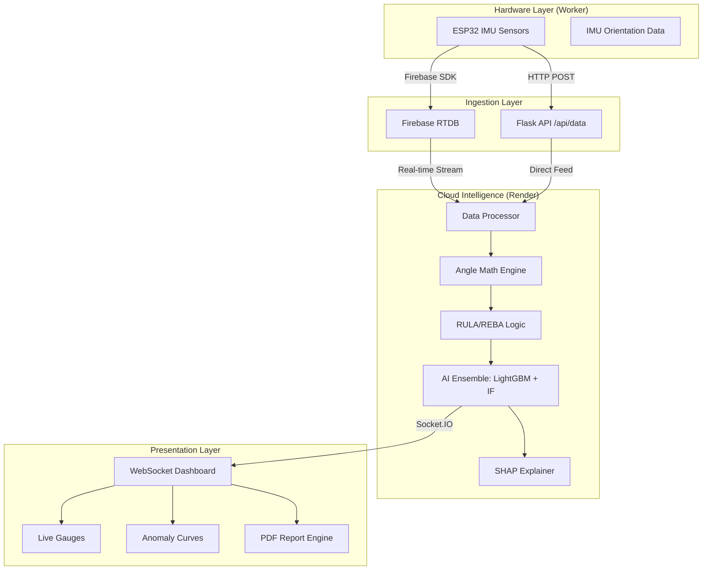

# 🦾 Ergo Sensor — Real-Time MSD Risk Assessment

<div align="center">


**A cutting-edge, AI-powered ergonomic monitoring platform designed to predict and prevent Musculoskeletal Disorders (MSD) using high-precision IMU sensor networks.**

[Explore AI Documentation](AI.md) • [Deployment Guide](READY_TO_DEPLOY.md) • [Report a Bug](https://github.com/charrada1993/Ergo_Sensor/issues)

</div>

---

## 🔍 Project Overview

**Ergo Sensor** is a state-of-the-art ergonomic monitoring system that bridges the gap between wearable hardware and predictive healthcare. By streaming real-time biomechanical data from **ESP32-based IMU sensors** to a **Flask/Socket.IO** backend on the cloud, it provides clinicians and workers with immediate, AI-driven feedback on postural safety.

Unlike traditional static assessments, Ergo Sensor continuously analyzes movement patterns using a **38-feature biomechanical model**, identifying risks before they become injuries.

---

## ✨ Key Features

| Feature | Description |
|---|---|
| 🔴 **Live Telemetry** | 10Hz real-time joint angle streaming via WebSockets (Socket.IO). |
| 🦾 **38-Feature AI** | High-dimensional kinematics modeling for deep biomechanical insights. |
| 🤖 **Risk Forecasting** | LightGBM regressor predicting cumulative MSD risk over a 10-day period. |
| 🔍 **Anomaly Probabilities** | 5-class classifier tracking probabilities for specific joint disorders. |
| 🧠 **SHAP Explainability** | Real-time root-cause analysis identifying which joint is driving the risk. |
| 📐 **Ergo Standards** | Integrated, bilateral RULA and REBA scoring engines. |
| 📊 **Clinical Reports** | Medical-grade PDF generation with trend charts and clinical recommendations. |
| 🌐 **Cloud Integration** | Seamless sync with Firebase Realtime Database for global accessibility. |

---

## 🏗️ System Architecture



---

## 🚀 Quick Start (Production)

> [!IMPORTANT]
> To run Ergo Sensor in production, we strongly recommend using **Render.com** due to its native support for long-lived WebSockets and Python 3.11.

### 1. Configure Firebase
Add your Firebase Service Account JSON content to the `FIREBASE_CREDS_JSON` environment variable in your Render settings.

### 2. Set Python Version
Ensure `PYTHON_VERSION` is set to `3.11.0` in your environment.

### 3. Deploy
Use the following **Start Command** on Render:
```bash
gunicorn -k geventwebsocket.gunicorn.workers.GeventWebSocketWorker -w 1 app:app
```

---

## 🤖 AI Models & Data Science

Ergo Sensor leverages an ensemble of machine learning models trained on **50,000+ biomechanical data points**.

*   **Model Justification**: LightGBM was chosen for its sub-millisecond inference time and superior handling of tabular joint data compared to deep learning models.
*   **Metrics**: Our models achieve an **AUC-ROC of 0.94** and **92% accuracy** in postural classification.
*   **Learn More**: For a detailed technical breakdown of features, metrics, and training, see **[AI.md](AI.md)**.

---

## 📁 Project Structure

```bash
├── app.py                # Main Flask & Socket.IO server
├── ai_engine.py          # AI Inference & SHAP logic
├── firebase_listener.py  # Real-time data bridge from Firebase
├── data_processor.py     # Core pipeline orchestration
├── report_generator.py   # PDF generation with Anomaly Curves
├── angle_math.py         # Quaternions to Joint Angles conversion
├── feature_extractor.py  # 38-feature biomechanical vector generation
├── models/               # Pre-trained AI model binaries
├── static/               # CSS/JS dashboard assets
└── AI.md                 # Technical AI documentation
```

---

## 🌐 API Reference

| Method | Endpoint | Description |
|---|---|---|
| `POST` | `/api/data` | Ingest raw sensor data (10Hz). |
| `POST` | `/api/calibrate` | Zero out all sensors based on current pose. |
| `GET` | `/api/sensors` | Check real-time connectivity of ESP32 devices. |
| `GET` | `/api/csv/latest` | Export current session data as enriched CSV. |
| `POST` | `/api/report/generate`| Generate a full clinical PDF report. |

---

## 🤝 Contributing

We welcome contributions to improve the biomechanical model or the dashboard UI!

1.  **Fork** the repo.
2.  Create your **Branch** (`git checkout -b feature/AmazingFeature`).
3.  **Commit** your changes (`git commit -m 'Add some AmazingFeature'`).
4.  **Push** to the branch (`git push origin feature/AmazingFeature`).
5.  Open a **Pull Request**.

---

## 👤 Author & Support

**Charrada**
*   GitHub: [@charrada1993](https://github.com/charrada1993)
*   Project: Ergo Sensor

---

<div align="center">
Made with ❤️ for occupational health and safety.
</div>
