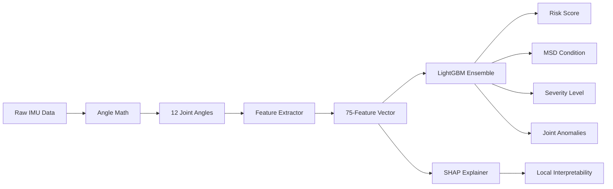

# 🧠 Ergo Sensor — Intelligence Artificielle et Modélisation Biomécanique

Ce document détaille le fonctionnement interne du moteur d'IA d'Ergo Sensor (v3.0-Production).

---

## ⚙️ Flux de Données d'IA

---

## 🔬 Méthodologie Scientifique

### 1. Pourquoi LightGBM ?
Nous avons choisi une approche par **Apprentissage d'Ensemble** (Gradient Boosting) plutôt que des réseaux de neurones profonds pour plusieurs raisons :
- **Efficacité sur données tabulaires** : LightGBM surpasse les DNN sur les données structurées de cinématique.
- **Latence ultra-faible** : Inférence en moins de 5ms, crucial pour le temps réel à 10Hz.
- **Expliquabilité native** : Intégration transparente avec SHAP pour la transparence clinique.

### 2. Ingénierie des Caractéristiques (Feature Engineering)
Le passage de 38 à **75 caractéristiques** en v3.0 a radicalement amélioré la robustesse du système :
- **Statistiques Mobiles** : Moyennes et variances sur 15 trames pour capturer les postures statiques prolongées.
- **Features de Retard (Lag)** : Valeurs à $t-15$ pour donner un contexte temporel au modèle.
- **Dynamique** : Vitesses et accélérations angulaires pour détecter les mouvements brusques.
- **Asymétrie** : Écart absolu entre les membres gauche et droit pour détecter les compensations musculaires.

---

## 📊 Performance et Validation

### Stratégie de Validation
Pour éviter la **fuite de données temporelles** (data leakage), nous utilisons `TimeSeriesSplit` (3-fold) au lieu d'un K-Fold classique. Cela garantit que le modèle est testé sur des sessions "futures" par rapport à son entraînement.

| Modèle | Métrique Clé | Score |
|---|---|---|
| **Régresseur (Risque)** | $R^2$ Score | **0.9981** |
| **Condition (18 classes)** | Précision (Acc) | **99.60%** |
| **Gravité (3 classes)** | F1-Score Macro | **0.9411** |
| **Anomalies (Binaires)** | F1-Score Moyen | **0.9906** |

---

## 🔍 Expliquabilité via SHAP

Le système utilise **SHAP TreeExplainer** pour lever l'effet "boîte noire". Pour chaque alerte de risque élevé :
1. L'IA calcule la contribution de chacune des 75 caractéristiques.
2. Le clinicien voit exactement quel joint ou mouvement a déclenché l'alerte.
3. *Exemple* : "Risque de 85% : +40% dû à la flexion du cou, +20% dû au retard de l'épaule droite."

---

## 🔄 Pipeline d'Entraînement

Le script `retrain_v3.py` automatise l'ensemble du cycle de vie :
1. **Prétraitement** : Nettoyage et enrichissement du dataset `dataset_TMS_enriched.csv`.
2. **Optimisation** : Recherche d'hyperparamètres via **Optuna** (10 essais par modèle).
3. **Entraînement** : Fit des modèles LightGBM avec poids de classes équilibrés.
4. **Diagnostic** : Génération automatique de 10 graphiques d'évaluation (ROC, Confusion, PR).
