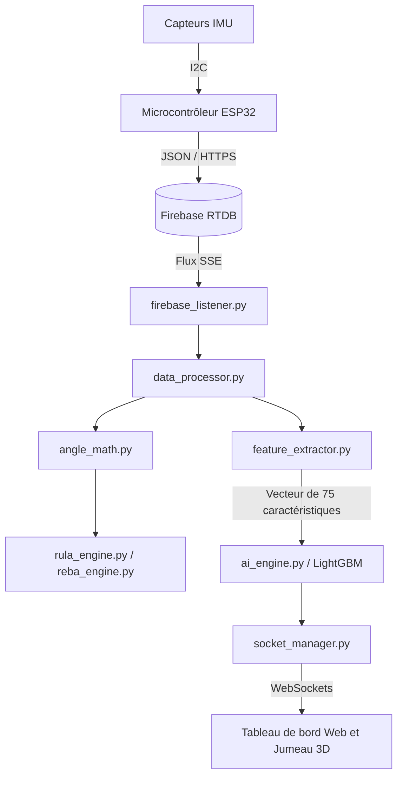

# 🎓 Ergo Sensor — Questions-réponses complètes du projet final (Guide de soutenance)

Ce document contient une liste structurée de questions et de réponses de niveau expert conçues pour vous préparer à la soutenance de votre projet final. Il couvre les aspects du contexte médical, du matériel, du logiciel, du pipeline en temps réel, des mathématiques et de l'intelligence artificielle du projet **Ergo Sensor**.

---

## 📑 Table des matières
1. [Vue d'ensemble générale et du projet](#1-vue-densemble-générale-et-du-projet)
2. [Contexte clinique et moteurs ergonomiques](#2-contexte-clinique-et-moteurs-ergonomiques)
3. [Infrastructure matérielle et flux de données IoT](#3-infrastructure-matérielle-et-flux-de-données-iot)
4. [Traitement du signal et mathématiques géométriques](#4-traitement-du-signal-et-mathématiques-géométriques)
5. [Architecture backend et concurrence](#5-architecture-backend-et-concurrence)
6. [Moteur d'IA v3.0-Production et ingénierie des caractéristiques](#6-moteur-dia-v30-production-et-ingénierie-des-caractéristiques)
7. [IA explicable (XAI) et diagnostic des modèles](#7-ia-explicable-xai-et-diagnostic-des-modèles)
8. [Visualisation frontend et jumeau numérique 3D](#8-visualisation-frontend-et-jumeau-numérique-3d)
9. [Déploiement et mise à l'échelle de la production](#9-déploiement-et-mise-à-léchelle-de-la-production)

---

## 1. Vue d'ensemble générale et du projet

### Q1 : Quel est l'objectif principal du projet Ergo Sensor ?
**Réponse :**
Le système **Ergo Sensor** est une plateforme de surveillance biomécanique de bout en bout, pilotée par l'IoT, conçue pour la santé et la sécurité au travail en temps réel. Il suit en continu la posture du travailleur à l'aide d'un réseau distribué de capteurs inertiels, calcule des scores de risque ergonomique (RULA et REBA) et utilise un ensemble de modèles d'apprentissage automatique optimisés (LightGBM) pour prévoir le risque cumulé, classer la gravité ergonomique, identifier les anomalies articulaires et diagnostiquer 18 conditions musculosquelettiques pathologiques distinctes.

### Q2 : Comment le système Ergo Sensor améliore-t-il les audits ergonomiques traditionnels ?
**Réponse :**
Les évaluations ergonomiques traditionnelles sont :
1. **Intermittentes/Réactives :** Les audits sont effectués manuellement une fois tous les quelques mois ou seulement après qu'un travailleur a signalé une blessure.
2. **Subjectives :** Les mesures anthropométriques sont prises visuellement ou avec des goniomètres à main, introduisant un biais d'observateur.
3. **Perturbatrices :** Les évaluateurs doivent suivre les travailleurs sur le terrain, modifiant les modèles de mouvement naturels.

**Ergo Sensor** transforme ce paradigme en un système **continu, objectif et proactif**. En diffusant les orientations articulaires à 10 Hz, il fournit un biofeedback à latence nulle, élimine l'erreur humaine grâce à une notation programmatique et exploite l'IA prédictive pour intervenir *avant* que les tensions répétitives ne dégénèrent en troubles musculosquelettiques (TMS) chroniques.

---

## 2. Contexte clinique et moteurs ergonomiques

### Q3 : Expliquez RULA et REBA et comment ils sont utilisés au sein du système.
**Réponse :**
*   **RULA (Rapid Upper Limb Assessment) :** Développé par McAtamney et Corlett, RULA cible les tâches sédentaires et intensives pour les membres supérieurs. Il évalue le cou, le tronc, le haut des bras, les avant-bras, les poignets et la torsion du poignet. Le score RULA final varie de **1 (acceptable)** à **7 (changement immédiat requis)**.
*   **REBA (Rapid Entire Body Assessment) :** Développé par Hignett et McAtamney, REBA est optimisé pour les tâches dynamiques, imprévisibles ou instables sur tout le corps (ex: soins de santé, levage en entrepôt). Il intègre les postures des membres inférieurs (jambes et genoux) et la qualité du couplage. Le score REBA final varie de **1 (risque négligeable)** à **15 (risque très élevé)**.

Les deux cadres sont implémentés en Python dans [rula_engine.py](file:///c:/MSD_System/rula_engine.py) et [reba_engine.py](file:///c:/MSD_System/reba_engine.py). Ils regroupent les segments corporels en Groupe A (membres supérieurs dans RULA ; tronc/cou/jambes dans REBA) et Groupe B (cou/tronc/jambes dans RULA ; membres supérieurs/avant-bras/poignets dans REBA), ajoutent des ajustements de force/charge et interrogent des tables de recherche multidimensionnelles prédéfinies pour produire les niveaux d'action finaux.

### Q4 : Que sont les moteurs ergonomiques bilatéraux et pourquoi sont-ils cliniquement significatifs ?
**Réponse :**
La plupart des audits ergonomiques traditionnels sur papier n'évaluent que le côté "le plus actif" ou "le plus chargé" du corps. Cependant, le suivi unilatéral cache des déséquilibres musculaires. 
Le [RULAEngine](file:///c:/MSD_System/rula_engine.py#L11) et le [REBAEngine](file:///c:/MSD_System/reba_engine.py#L11) calculent les niveaux de risque pour **les côtés gauche et droit du corps simultanément**. Cliniquement, cela permet d'identifier une charge asymétrique (ex: un travailleur favorisant son bras gauche en raison de la fatigue ou de la douleur du côté droit), ce qui est un précurseur majeur de l'usure articulaire chronique et du désalignement de la colonne vertébrale.

---

## 3. Infrastructure matérielle et flux de données IoT

### Q5 : Décrivez le pipeline de données de bout en bout, du mouvement physique à l'interface utilisateur en temps réel.
**Réponse :**
Le flux de données se compose de 7 étapes :
1.  **Détection :** Les unités de mesure inertielle (IMU) suivent l'accélération sur 3 axes et la vitesse angulaire.
2.  **Calcul à la périphérie :** Un microcontrôleur ESP32 échantillonne les capteurs à 10 Hz (toutes les 100 ms) et calcule l'orientation brute.
3.  **Ingestion :** L'ESP32 transmet les données d'orientation au format JSON via Wi-Fi/HTTPS à une base de données Firebase Realtime Database.
4.  **Écoute backend :** Un thread d'arrière-plan dans le backend Flask ([firebase_listener.py](file:///c:/MSD_System/firebase_listener.py)) s'abonne aux événements Firebase et achemine les paquets entrants vers [DataProcessor](file:///c:/MSD_System/data_processor.py#L13).
5.  **Traitement biomécanique :** [angle_math.py](file:///c:/MSD_System/angle_math.py) extrait les angles articulaires, et les moteurs RULA/REBA calculent les scores de risque instantanés.
6.  **Inférence d'IA :** Les angles calculés sont transmis à [FeatureExtractor](file:///c:/MSD_System/feature_extractor.py#L29) pour générer le vecteur de 75 caractéristiques, qui est injecté dans les modèles LightGBM dans [AIModels](file:///c:/MSD_System/ai_engine.py#L18) pour des prédictions en temps réel.
7.  **Diffusion et rendu :** Le backend transmet les mesures traitées au navigateur frontend via des WebSockets ([socket_manager.py](file:///c:/MSD_System/socket_manager.py)). Le frontend met à jour les graphiques en direct et grée l'avatar en bâtonnets 3D.



### Q6 : Quelle est la stratégie de placement du matériel pour un audit biomécanique complet ?
**Réponse :**
Pour une évaluation cinématique complète, jusqu'à 12 capteurs sont répartis comme suit :
*   **Axial (Noyau) :** Tête/Cou (placé en C7) et Haut du dos (placé en T12/tronc).
*   **Membres supérieurs bilatéraux :** Biceps, avant-bras et mains (pour les angles de l'épaule, du coude et du poignet).
*   **Membres inférieurs bilatéraux :** Cuisses et jambes (pour les angles de la hanche, du genou et de la cheville).

---

## 4. Traitement du signal et mathématiques géométriques

### Q7 : Comment le système gère-t-il l'étalonnage des capteurs ? Référence `angle_math.py`.
**Réponse :**
Pour tenir compte de la variation individuelle du montage des capteurs, le système met en œuvre une phase d'étalonnage :
1.  Le travailleur se tient dans une posture de référence neutre et droite (**"All Angle Position 0"**).
2.  L'interface utilisateur déclenche l'API `/api/calibrate`. Les angles d'Euler bruts actuels (Roulis, Tangage, Lacet) pour tous les capteurs sont enregistrés comme références à l'aide de [set_reference](file:///c:/MSD_System/angle_math.py#L6).
3.  Pendant le fonctionnement actif, l'assistant [get](file:///c:/MSD_System/angle_math.py#L51) soustrait ces valeurs de référence de la télémétrie brute entrante :
    $$\theta_{\text{étalonné}} = \theta_{\text{brut}} - \theta_{\text{référence}}$$
4.  Tous les angles articulaires cinématiques ultérieurs sont calculés de manière différentielle par rapport à cette posture zéro étalonnée, assurant un alignement des coordonnées spécifique au patient.

### Q8 : Expliquez les mathématiques derrière le calcul de la flexion du cou et du coude.
**Réponse :**
Dans [angle_math.py](file:///c:/MSD_System/angle_math.py) :
*   **Flexion du cou (différence de tangage) :** Le tangage du cou est calculé par rapport au tangage du tronc :
    $$\text{Flexion du cou} = \text{Tangage du cou}_{\text{étalonné}} - \text{Tangage du tronc}_{\text{étalonné}}$$
*   **Flexion du coude (angle interne) :** La flexion du coude est calculée comme la différence de tangage absolue entre les capteurs de l'avant-bras et du biceps :
    $$\text{Flexion du coude} = |\text{Tangage de l'avant-bras}_{\text{étalonné}} - \text{Tangage du biceps}_{\text{étalonné}}|$$
    Cette conception isole la rotation de l'articulation charnière du coude, la rendant invariante par rapport au cap absolu du corps.

---

## 5. Architecture backend et concurrence

### Q9 : Quel est le but de Flask-SocketIO et Gevent dans cette application ?
**Réponse :**
La gestion de flux de capteurs en temps réel à haute fréquence nécessite une architecture de serveur non bloquante :
*   **Flask-SocketIO :** Fournit des connexions WebSocket duplex intégral à faible latence. Cela permet au serveur de diffuser les angles articulaires et les prédictions au navigateur toutes les 100 ms.
*   **Gevent (greenlets basés sur les coroutines) :** Remplace les threads standard du système d'exploitation synchrone par des tâches coopératives légères. Il permet à l'application Flask d'exécuter le serveur Web, d'écouter les flux de la base de données Firebase, d'écrire les journaux de télémétrie sur le disque et d'exécuter des inférences d'apprentissage automatique de manière simultanée sans bloquer la boucle d'événements principale.

### Q10 : Comment le backend empêche-t-il l'engorgement de la base de données pendant la diffusion à haute fréquence ?
**Réponse :**
La diffusion de données de capteurs à 10 Hz peut submerger les moteurs de base de données standard. Le système résout cela via deux stratégies :
1.  **Firebase Realtime Database :** Utilise des WebSockets/Server-Sent Events (SSE) directs pour pousser les paquets de données brutes de manière asynchrone plutôt que par interrogation.
2.  **Journalisation locale sécurisée pour les threads :** Dans [csv_logger.py](file:///c:/MSD_System/csv_logger.py), les trames de télémétrie entrantes sont stockées dans une file d'attente en mémoire. Un thread d'arrière-plan dédié vide périodiquement les données en file d'attente vers un journal de session CSV, empêchant les opérations d'E/S disque de bloquer la boucle d'inférence en temps réel.

---

## 6. Moteur d'IA v3.0-Production et ingénierie des caractéristiques

### Q11 : Expliquez le passage du vecteur de 38 caractéristiques au vecteur de 75 caractéristiques dans la version 3.0-Production.
**Réponse :**
Les premières versions du système analysaient des instantanés statiques de posture, ce qui entraînait un taux élevé de faux positifs puisque les humains passent naturellement par des angles à haut risque brièvement. 
La version 3.0-Production ajoute des **caractéristiques temporelles** dans [engineer_features](file:///c:/MSD_System/retrain_v3.py#L62), étendant l'espace des caractéristiques de 38 à 75 dimensions :
1.  **Biomécanique de base (38) :** Angles bruts, vitesses, fréquences et durées.
2.  **Moyennes mobiles (12) :** Moyenne sur 15 trames des articulations centrales pour capturer les postures soutenues/statiques.
3.  **Écarts-types mobiles (12) :** Variance sur 15 trames pour suivre les tremblements, les secousses ou les micro-vibrations.
4.  **Caractéristiques de retard (12) :** L'angle de l'articulation il y a 15 trames (~1,5 seconde), donnant au modèle un contexte temporel.
5.  **Asymétrie bilatérale (5) :** Delta absolu entre les articulations des membres gauche et droit.
6.  **Charge composite (2) :** Scores de charge pondérés mathématiquement représentant la tension du haut et du bas du corps.
7.  **Drapeaux de posture à haut risque (3) :** Drapeaux binaires codés en dur pour l'hyperflexion extrême.
8.  **Accélérations (5) :** Doubles dérivées des angles pour capturer les mouvements rapides et saccadés.
9.  **Proxys d'énergie (7) :** Produit de la vitesse et des durées, servant de proxys pour la dépense cinétique.

### Q12 : Pourquoi les modèles LightGBM sont-ils choisis pour le moteur d'IA plutôt que les réseaux neuronaux profonds ?
**Réponse :**
1.  **Efficacité tabulaire :** LightGBM (Light Gradient Boosting Machine) est à la pointe de la technologie pour les données tabulaires, surpassant les réseaux neuronaux profonds sur la classification basée sur les caractéristiques.
2.  **Faible latence :** Les inférences s'exécutent en <5 ms, ce qui est crucial pour un pipeline de streaming en temps réel à 10 Hz.
3.  **Expliquabilité :** Les modèles basés sur les arbres permettent de calculer nativement l'importance des caractéristiques et s'intègrent parfaitement à SHAP TreeExplainer.
4.  **Empreinte légère :** Les fichiers de modèles compilés (`.txt` et `.pkl`) ne pèsent que quelques centaines de kilo-octets, ce qui permet un déploiement sur des serveurs périphériques aux ressources limitées.

### Q13 : Quels sont les trois principaux modèles d'IA fonctionnant dans le système ?
**Réponse :**
| Modèle | Cible | Mesure de base (v3.0-Production) |
|---|---|---|
| **Régresseur LightGBM** | Prédit la probabilité de blessure cumulée sur 10 jours `[0,0 – 1,0]` | $R^2 = 0,9981$, $MAE = 0,0056$ |
| **Classificateur de condition LightGBM** | Classe 18 pathologies médicales distinctes (ex: canal carpien, hernie lombaire) | Précision = $99,60\%$, F1 Macro = $0,9667$ |
| **Classificateur de gravité LightGBM** | Classe le niveau de gravité du risque ergonomique (`faible`, `moyen`, `élevé`) | Précision = $96,95\%$, F1 Macro = $0,9411$ |

### Q14 : Comment le système gère-t-il le déséquilibre des classes pour les 18 conditions pathologiques ?
**Réponse :**
Avec 18 conditions, les ensembles de données cliniques sont naturellement asymétriques (ex: beaucoup plus d'échantillons "Normaux" ou "Tension légère" que de conditions pathologiques rares). Le pipeline d'entraînement résout cela par :
1.  L'application de `class_weight='balanced'` dans LightGBM, qui met automatiquement à l'échelle la pénalité de gradient inversement proportionnelle aux fréquences des classes.
2.  L'utilisation de **F1-Macro** comme mesure d'optimisation principale dans Optuna plutôt que la précision brute, garantissant que les classes minoritaires sont classées avec précision.

### Q15 : Pourquoi la validation croisée K-Fold standard est-elle dangereuse pour cet ensemble de données, et comment cela est-il résolu ?
**Réponse :**
La validation croisée K-Fold standard mélange les données de manière aléatoire. Dans un flux de télémétrie de séries temporelles, les trames consécutives (trame $t$ et trame $t+1$) sont fortement corrélées. Si vous les divisez de manière aléatoire, le modèle "mémorisera" les trames voisines pendant l'entraînement et obtiendra des scores de validation artificiellement gonflés (fuite de données temporelles).
Pour éviter cela, le pipeline d'entraînement dans [retrain_v3.py](file:///c:/MSD_System/retrain_v3.py) utilise `TimeSeriesSplit` (3 plis). Il divise les données chronologiquement, simulant la production réelle où le modèle est évalué sur des sessions futures et invisibles.

---

## 7. IA explicable (XAI) et diagnostic des modèles

### Q16 : Qu'est-ce que SHAP et comment est-il intégré au flux de travail clinique ?
**Réponse :**
**SHAP (SHapley Additive exPlanations)** est une approche basée sur la théorie des jeux pour expliquer les prédictions individuelles d'apprentissage automatique. 
Le système exécute un **SHAP TreeExplainer** sur les modèles LightGBM. Pour chaque alerte à haut risque ou condition classée, SHAP calcule la contribution exacte (en log-odds ou probabilité) de chacune des 75 caractéristiques. 

**Bénéfice clinique :** Au lieu d'être une "boîte noire", le tableau de bord indique au clinicien *pourquoi* l'IA a signalé un risque élevé :
> *"Le risque sur 10 jours est de 85%, principalement dû à la rotation moyenne du tronc (+12%) et au retard de l'épaule droite (+8%), plutôt qu'à l'angle du cou."*

```text
[Risque faible] ◄─────────────────── [Valeur de base : 0,15] ───────────────────► [Risque élevé (0,85)]
                                      │
                   -2% Flexion du cou ──┼── +12% Rotation moyenne du tronc
                 -1% Flexion du coude ──┼── +8% Retard épaule D
```

### Q17 : Quelles mesures de diagnostic sont générées automatiquement par la suite d'évaluation ?
**Réponse :**
Les scripts `generate_eval_plots.py` et `retrain_v3.py` génèrent une suite de diagnostic de 10 tracés enregistrés dans `models/` et `plots/`, comprenant :
1.  **Tracés de dispersion et de résidus prédits vs réels :** Pour évaluer la dérive de la régression.
2.  **Matrices de confusion multiclasses :** Pour identifier lesquelles des 18 conditions sont confondues.
3.  **Courbes ROC (Receiver Operating Characteristic) et Précision-Rappel One-vs-Rest :** Pour mesurer les seuils de sensibilité.
4.  **Courbes d'apprentissage :** Pour surveiller la convergence de l'entraînement et détecter le surapprentissage.

---

## 8. Visualisation frontend et jumeau numérique 3D

### Q18 : Comment le jumeau numérique 3D fonctionne-t-il dans le tableau de bord web ?
**Réponse :**
Le jumeau numérique 3D est rendu dans le navigateur à l'aide de **Three.js** (WebGL). 
1.  Un modèle humanoïde en bâtonnets 3D est construit comme un arbre hiérarchique de nœuds articulaires (ex: le cou est un enfant du haut du dos ; l'épaule droite est un enfant de la colonne vertébrale, etc.).
2.  Lorsque Socket.IO reçoit la charge utile de 10 Hz contenant les angles d'Euler, un gestionnaire d'événements Javascript intercepte le message.
3.  Le script mappe les angles de tangage, de roulis et de lacet aux matrices de rotation locales des articulations du squelette 3D correspondantes :
    ```javascript
    neckJoint.rotation.x = payload.angles.Neck * (Math.PI / 180); // Tangage
    neckJoint.rotation.z = payload.angles.Neck_Roll * (Math.PI / 180); // Roulis
    ```
4.  Three.js effectue un nouveau rendu de la scène à 60 FPS, affichant un miroir fluide et en temps réel des mouvements physiques du travailleur.

### Q19 : Comment le mode Clair/Sombre de la page d'étalonnage est-il implémenté ?
**Réponse :**
L'interface utilisateur présente une esthétique clinique persistante en mode sombre avec un repli en mode clair. 
1.  **Variables CSS :** Les couleurs de base sont définies dans `static/style.css` à l'aide de propriétés personnalisées :
    ```css
    :root {
        --bg-color: #0b0f19;
        --card-bg: rgba(255, 255, 255, 0.03);
        --text-color: #f3f4f6;
    }
    [data-theme="light"] {
        --bg-color: #f9fafb;
        --card-bg: #ffffff;
        --text-color: #111827;
    }
    ```
2.  **Gestion de l'état :** Lorsque l'utilisateur bascule l'interrupteur, Javascript applique l'attribut `data-theme="light"` à la balise `<html>` et enregistre la préférence dans `localStorage`.
3.  **Intégration des graphiques :** Le changement de thème déclenche un nouveau rendu des éléments Chart.js, échangeant les couleurs des lignes de grille et des étiquettes pour maintenir la lisibilité clinique dans les deux environnements.

---

## 9. Déploiement et mise à l'échelle de la production

### Q20 : Comment l'application est-elle configurée pour le déploiement en production sur Render.com ?
**Réponse :**
1.  **Serveur HTTP WSGI :** Les serveurs de développement Flask standard sont monothread et bloquent sur les requêtes longues. En production, nous exécutons **Gunicorn** avec une classe de worker compatible gevent :
    ```bash
    gunicorn -k geventwebsocket.gunicorn.workers.GeventWebSocketWorker -w 1 app:app
    ```
2.  **Variables d'environnement :** Les identifiants et configurations sensibles sont injectés via des variables d'environnement :
    *   `FIREBASE_CREDS_JSON` : La chaîne JSON brute de la clé de compte de service Firebase.
    *   `PYTHON_VERSION` : Définie sur `3.11.0` pour épingler les dépendances.
3.  **Allocation de port :** Gunicorn se lie dynamiquement au port fourni par la variable d'environnement `PORT`.

### Q21 : Quelles sont les principales étapes de dépannage si la connexion Firebase échoue ?
**Réponse :**
1.  **Vérifier la clé du compte de service :** Assurez-vous que la variable d'environnement `FIREBASE_CREDS_JSON` est un objet JSON valide commençant par `{` et contient les identifiants de clé privée.
2.  **Valider l'URL de la base de données :** Assurez-vous que `Config.FIREBASE_DATABASE_URL` correspond à l'instance du projet Firebase (se terminant généralement par `.firebaseio.com`).
3.  **Accès réseau :** Vérifiez que le port sortant `443` du serveur est ouvert pour établir des connexions SSE/WebSocket sécurisées avec les serveurs Firebase.
4.  **Repli en mode local :** Si Firebase est indisponible, le repli du système permet de recevoir des données via le point de terminaison de l'API REST `/api/data`.

---

## 💡 Stratégie de présentation de la soutenance
*   **Diapositive 1 : Le problème :** Concentrez-vous sur le fait que les TMS sont la première cause d'incapacité professionnelle, coûtant des milliards aux entreprises chaque année.
*   **Diapositive 2 : La solution :** Montrez le réseau matériel ESP32 + IMU.
*   **Diapositive 3 : Moteur ergonomique :** Expliquez comment RULA/REBA sont automatisés. Mentionnez le calcul *bilatéral*.
*   **Diapositive 4 : Le noyau d'IA :** Détaillez le vecteur de 75 caractéristiques. Soulignez que les retards de séries temporelles et les moyennes mobiles empêchent les alertes de faux positifs.
*   **Diapositive 5 : Expliquabilité :** Montrez un graphique SHAP. Expliquez que les cliniciens doivent comprendre *pourquoi* l'IA fait une prédiction.
*   **Diapositive 6 : Démonstration du système :** Présentez le jumeau numérique 3D et les rapports PDF automatisés.
