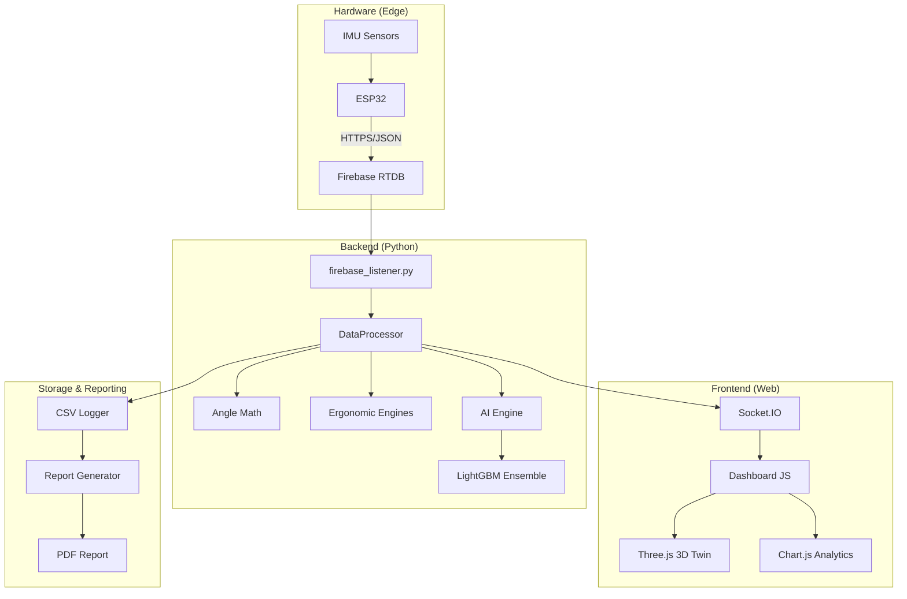

# Ergo Sensor v3.0 - Pile Technologique

Ce document présente les technologies, bibliothèques et frameworks de base utilisés pour construire le pipeline d'IA et l'application web Ergo Sensor.

---

## 🏗️ Architecture Globale

---

## 1. Backend et Infrastructure Serveur
Le système central est construit sur un backend Python asynchrone haute performance.

*   **Python (3.9+)** : Langage principal pour le traitement des données et l'IA.
*   **Flask** : Framework web léger pour le routage et l'API (`app.py`).
*   **Flask-SocketIO / Eventlet / Gevent** : Communication bidirectionnelle en temps réel à 10Hz.
*   **Gunicorn** : Serveur HTTP WSGI de production.
*   **SDK Admin Firebase** : Connexion sécurisée à la base de données temps réel.

## 2. Intelligence Artificielle et Apprentissage Automatique
Le moteur d'IA utilise un ensemble multi-modèle pour la prédiction des risques.

*   **LightGBM** : Framework de Boosting de Gradient pour les modèles prédictifs.
    *   *Régresseur* : Scores de risque continus sur 10 jours.
    *   *Classificateur* : 18 pathologies médicales.
*   **Scikit-Learn** : Utilitaires de prétraitement et de validation (`TimeSeriesSplit`).
*   **Optuna** : Optimisation automatisée des hyperparamètres.
*   **SHAP** : IA explicable via `TreeExplainer`.
*   **Pandas & NumPy** : Manipulation intensive de données de séries temporelles.

## 3. Traitement Ergonomique et Biomécanique
*   **Mathématiques Python (`angle_math.py`)** : Calcul des angles articulaires 3D via trigonométrie vectorielle.
*   **RULA & REBA** : Implémentations programmatiques des normes cliniques internationales.

## 4. Frontend et Interface Utilisateur
*   **HTML5 / Jinja2** : Modèles dynamiques.
*   **CSS3 Vanille** : Glassmorphisme et design "Dark-Mode" clinique.
*   **JS Vanille (ES6)** : Logique client ultra-rapide sans frameworks lourds.
*   **Three.js / WebGL** : Rendu 3D temps réel du squelette.
*   **Chart.js** : Visualisation des tendances cinématiques.

## 5. Génération de Rapports
*   **ReportLab** : Construction programmatique de PDF A4.
*   **Matplotlib** : Génération de graphiques scientifiques pour les rapports.

## 6. Cloud et Déploiement
*   **Render.com** : Plateforme de déploiement (PaaS).
*   **Firebase Realtime Database** : Courtier de messages haute vitesse.
